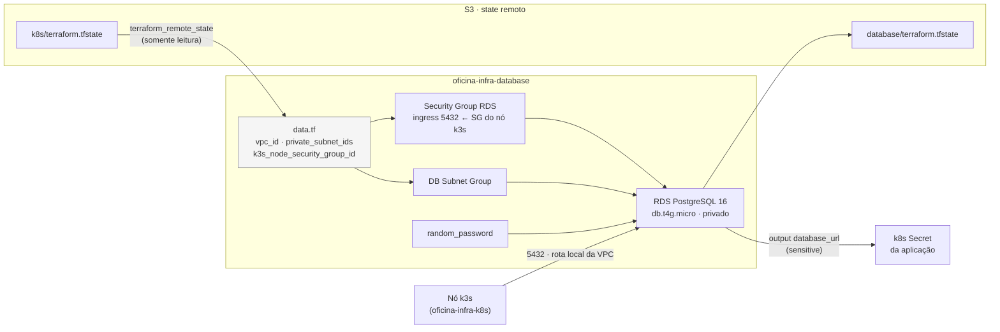

# oficina-infra-database

Infraestrutura do **banco de dados gerenciado** do sistema de gestão de oficina mecânica: uma instância RDS PostgreSQL provisionada com Terraform na AWS (`sa-east-1`).

> Parte do Tech Challenge SOAT — Fase 3. Repositórios irmãos:
> [`oficina-infra-k8s`](https://github.com/Luizustavo/oficina-infra-k8s) ·
> [`oficina-lambda-auth`](https://github.com/Luizustavo/oficina-lambda-auth) ·
> [`oficina-backend`](https://github.com/Luizustavo/oficina-backend)

---

## ⚠️ Depende de `oficina-infra-k8s`

Este repositório **não cria rede**. Ele lê a VPC, as subnets privadas e o security group do nó k3s do state de [`oficina-infra-k8s`](https://github.com/Luizustavo/oficina-infra-k8s), via `terraform_remote_state` em modo somente leitura (`data.tf`).

Duplicar esses recursos aqui criaria duas fontes de verdade para a mesma rede e um conflito garantido na hora do destroy. O preço dessa escolha é uma ordem obrigatória: **`oficina-infra-k8s` precisa ter dado apply pelo menos uma vez antes do primeiro apply daqui.** A pipeline verifica isso e falha com mensagem clara se o state de rede não existir.

## Propósito

| Recurso | Descrição |
|---|---|
| `aws_db_instance` | PostgreSQL 16, `db.t4g.micro`, 20 GB, single-AZ, sem acesso público |
| `aws_db_subnet_group` | Grupo formado pelas duas subnets **privadas** vindas do repo de rede |
| `aws_security_group` | Libera a porta 5432 **exclusivamente** para o security group do nó k3s |
| `random_password` | Senha do usuário master, gerada com 24 caracteres e nunca versionada |

## Arquitetura deste repositório



### Por que PostgreSQL gerenciado

O modelo de dados da oficina é fortemente relacional — cliente → veículo → ordem de serviço → itens — e as regras de negócio exigem transações ACID: aprovar um orçamento altera status, calcula total e baixa estoque de peças, tudo ou nada. Um banco relacional é a escolha natural, e o RDS entrega backup automático, patching e métricas sem trabalho operacional.

Justificativa formal completa em `RFC-002` (repositório `oficina-backend`).

## Tecnologias

| Camada | Tecnologia |
|---|---|
| IaC | Terraform >= 1.11 (providers AWS ~> 5.0, random ~> 3.6) |
| State remoto | S3 com lock nativo (`use_lockfile`) — sem DynamoDB |
| Banco | Amazon RDS PostgreSQL 16 |
| CI/CD | GitHub Actions |

---

## Pré-requisitos

- Terraform >= 1.11
- AWS CLI v2 com profile configurado
- **`oficina-infra-k8s` já aplicado** (ver seção acima)

## Como aplicar

```bash
cp terraform.tfvars.example terraform.tfvars   # ajuste se quiser
terraform init
terraform plan
terraform apply
```

O RDS leva ~8-10 minutos para ficar disponível — bem mais lento que o resto da infraestrutura.

## Como consumir a connection string

O output `database_url` é marcado como `sensitive` e **nunca** deve ser commitado nem colado em manifesto versionado:

```bash
terraform output -raw database_url
```

Ele já vem com `?sslmode=no-verify`: o RDS exige conexão criptografada, e o driver usado em runtime (`@prisma/adapter-pg`) não negocia TLS a partir de uma URL simples. O certificado do RDS não está na trust store do Node, então `sslmode=require` puro falha na verificação.

Use o valor para popular o Secret do Kubernetes descrito em `oficina-backend/k8s/README.md`.

---

## CI/CD

`.github/workflows/terraform.yml`:

| Gatilho | O que roda |
|---|---|
| Pull Request para `main` | `fmt -check` → `init` → checagem do state de rede → `validate` → `plan`, com o plan comentado no PR |
| Push em `main` | `apply` automático — é o "deploy automático da branch de produção" exigido pela Fase 3 |
| `workflow_dispatch` | `plan`, `apply` ou `destroy` sob demanda |

O job de apply roda no Environment `production`. Ele existe mas **está sem required reviewers**, então o apply é de fato automático no merge. Para exigir aprovação humana antes de cada mudança de infraestrutura, adicione reviewers em *Settings → Environments → production* — o pipeline passa a pausar e esperar.

**Secrets necessários** em *Settings → Secrets and variables → Actions*:

| Secret | Valor |
|---|---|
| `AWS_ACCESS_KEY_ID` | Chave do usuário IAM de deploy |
| `AWS_SECRET_ACCESS_KEY` | Segredo correspondente |

**Proteção da branch `main`** (*Settings → Branches → Add rule*): exigir Pull Request, exigir o job `Plan` verde e bloquear push direto.

---

## ⚠️ Ordem de destroy

Este repositório é o **primeiro** a ser destruído — o RDS depende da rede do outro:

```
1. oficina-infra-database   (terraform destroy)  ← este repositório
2. oficina-infra-k8s        (terraform destroy)
```

`skip_final_snapshot = true` e `deletion_protection = false` estão ligados de propósito, para que o ciclo criar/destruir de um projeto acadêmico seja rápido e não deixe snapshots cobrando. **Em produção de verdade, os dois valores devem ser invertidos.**

## Custo aproximado

| Recurso | US$/hora | Free tier (conta nova)? |
|---|---|---|
| RDS db.t4g.micro | ~0,03 | Sim — 750h/mês nos primeiros 12 meses |
| Storage 20 GB gp2 | ~0,003 | Sim — até 20 GB |

## API

Este repositório não expõe API. O schema do banco é versionado com Prisma Migrate em [`oficina-backend`](https://github.com/Luizustavo/oficina-backend); a documentação Swagger responde em `{app_url}/api/docs`.
